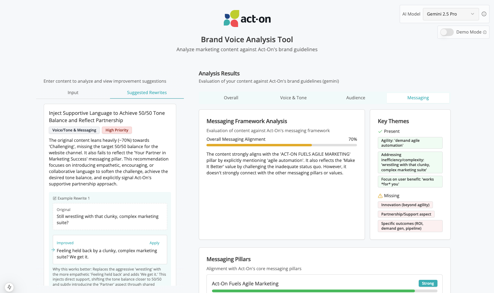

# Act-On Brand Coach

A modern web application for analyzing marketing content against Act-On's brand guidelines. This tool helps marketers create content that aligns with the brand voice, audience targeting, and messaging pillars.



## Features

- **Content Analysis**: Paste or upload marketing content for instant analysis 
- **Multi-Platform Support**: Analyze content for different marketing channels (website, email, social media, etc.)
- **Comprehensive Evaluation**: Review analysis results across:
  - Voice & Tone
  - Audience Targeting
  - Messaging Framework
  - Overall Brand Alignment
- **AI-Powered Rewrites**: Generate improved content suggestions based on brand guidelines
- **Multiple AI Model Support**: Choose between different AI providers (Anthropic, OpenAI, Google)
- **Demo Mode**: Experience the functionality without calling external APIs

## Tech Stack

- **Next.js 15** with App Router
- **React 19**
- **TypeScript**
- **Tailwind CSS**
- **Shadcn UI** components
- **Framer Motion** for animations
- **AI SDK** for LLM integration

## Getting Started

### Prerequisites

- Node.js 18+ 
- npm or yarn

### Installation

```bash
# Clone the repository
git clone https://github.com/your-username/brand-coach-app.git
cd brand-coach-app

# Install dependencies
npm install

# Start the development server
npm run dev
```

Open [http://localhost:3000](http://localhost:3000) in your browser to see the application.

### Build for Production

```bash
# Build the application
npm run build

# Start the production server
npm run start
```

## Usage

1. Enter your marketing content in the text area
2. Select the target platform (website, email, social media, etc.)
3. Click "Analyze Content"
4. Review the analysis results across different tabs
5. Generate rewrite suggestions based on the analysis
6. Apply suggested rewrites to your content as needed

## License

[MIT](LICENSE)